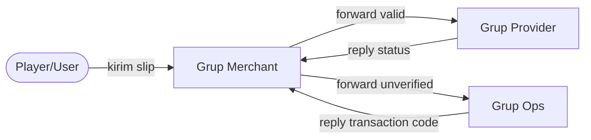
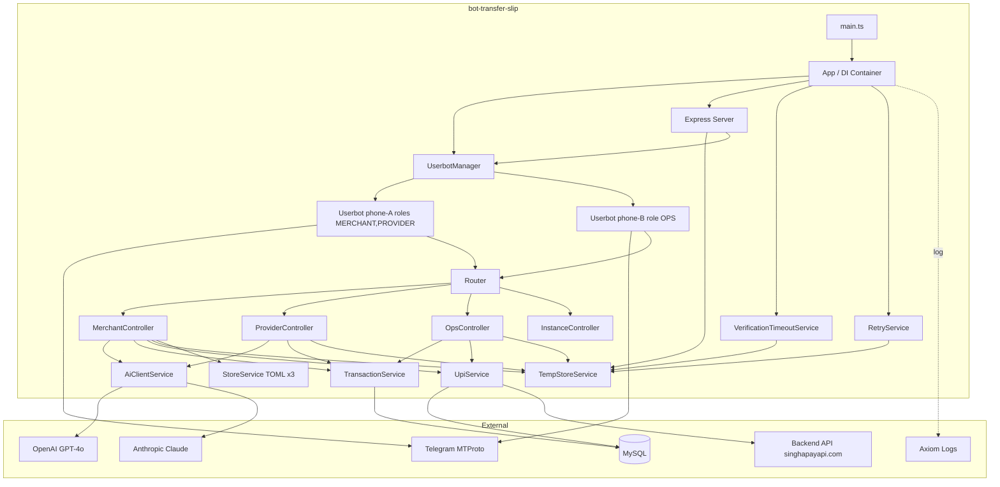
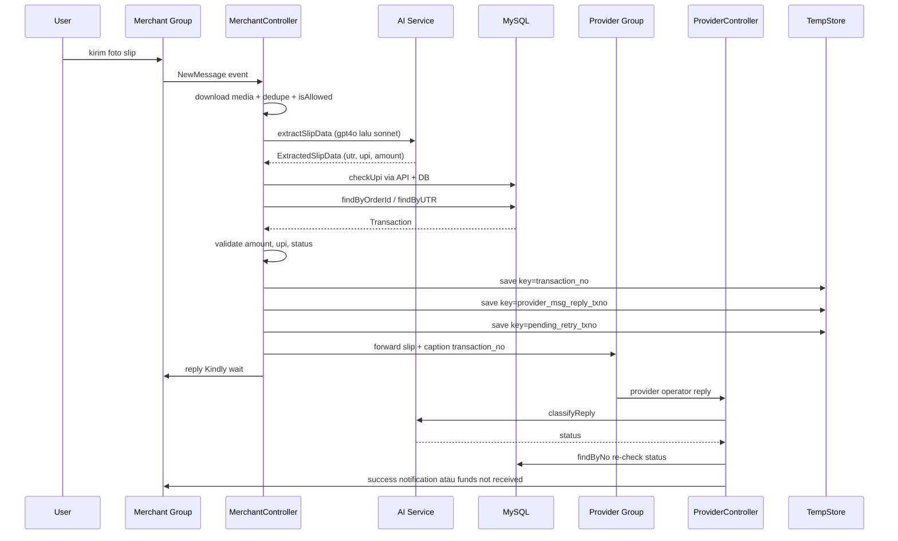
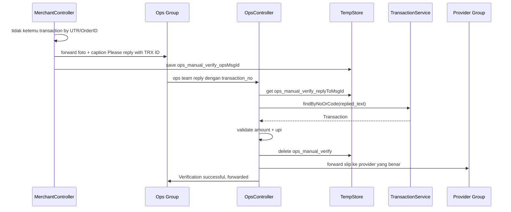
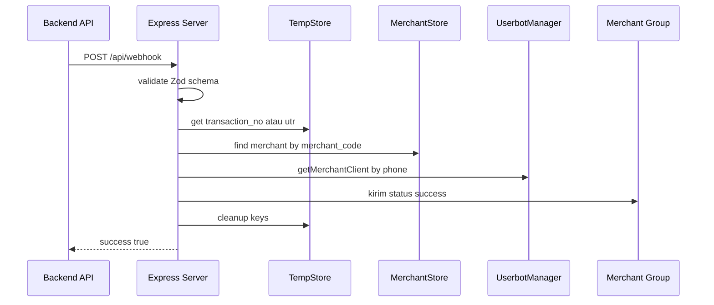
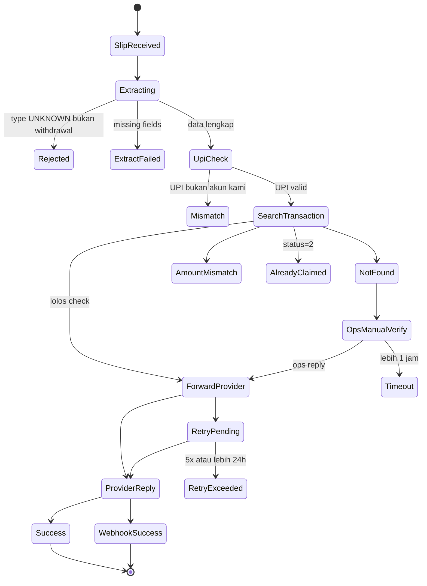
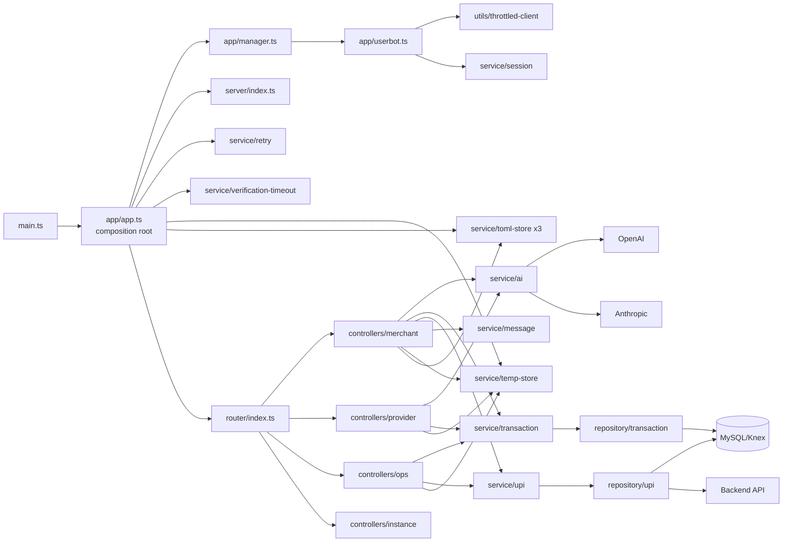

# Bot Transfer Slip — Analisa Proyek

> Dokumen onboarding untuk PIC baru. Fokus ke arsitektur, code internals, dan foot-guns yang tidak tertulis di README.

---

## Daftar Isi

1. [TL;DR](#1-tldr)
2. [Glosarium Domain](#2-glosarium-domain-payment-india)
3. [Mental Model](#3-mental-model)
4. [Diagram Arsitektur](#4-diagram-arsitektur)
5. [Struktur Folder & Navigasi Cepat](#5-struktur-folder--navigasi-cepat)
6. [Layer & Dependency Graph](#6-layer--dependency-graph)
7. [Domain Konsep Inti](#7-domain-konsep-inti)
8. [State & Persistensi](#8-state--persistensi)
9. [Konvensi Key Temp-Store](#9-konvensi-key-temp-store)
10. [Walkthrough 3 Skenario](#10-walkthrough-3-skenario-end-to-end)
11. [Telegram Commands Cheatsheet](#11-telegram-commands-cheatsheet)
12. [HTTP API Cheatsheet](#12-http-api-cheatsheet)
13. [Throttle & Anti-Ban Layer](#13-throttle--anti-ban-layer)
14. [Brand Differences](#14-brand-differences-s88pay-vs-singhapay)
15. [Setup Lokal](#15-setup-lokal-step-by-step)
16. [Catatan Penting / Foot-guns](#16-catatan-penting--foot-guns)
17. [Refactor Backlog (Opini)](#17-refactor-backlog-opini)
18. [Langkah Pertama untuk PIC Baru](#18-langkah-pertama-untuk-pic-baru)

---

## 1. TL;DR

**Bot Transfer Slip** adalah **Telegram userbot** multi-role berbasis TypeScript yang mengotomatisasi verifikasi slip transfer pembayaran antar tiga pihak: **Merchant** (pelanggan upload slip), **Provider** (bank/biller yang memproses), dan **Ops** (CS untuk verifikasi manual). Sistem dipakai oleh payment gateway untuk pasar India (UPI/UTR), dengan dukungan multi-brand (`s88pay` & `singhapay`).

Sistem login pakai **nomor HP asli via MTProto/GramJS** (bukan Bot API), sehingga bisa membaca pesan grup tanpa harus diundang sebagai bot. Satu nomor HP dapat menjalankan beberapa role sekaligus tanpa cross-interference, dengan **routing berbasis nomor telepon** yang dipetakan via file TOML.

OCR slip dilakukan dual-model (**GPT-4o + Claude Sonnet** dengan strategi `pickBest`), klasifikasi balasan provider via AI, persistence config via TOML, state in-flight via filesystem JSON dengan TTL, dan data transaksi via MySQL/Knex. HTTP API Express (`/api/webhook`, `/api/userbot/*`) untuk integrasi backend dan management remote.

**Stack ringkas:** TypeScript + Vite SSR + GramJS (telegram) + Express + Knex/MySQL + OpenAI + Anthropic + Pino/Axiom + Zod + p-queue.

---

## 2. Glosarium Domain Payment India

Istilah-istilah yang muncul di kode dan wajib dipahami sebelum membaca controller.

| Istilah | Arti | Contoh |
|---|---|---|
| **UTR** | Unique Transaction Reference. Nomor 12 digit yang dikeluarkan bank untuk identifikasi unik transfer. Dipakai sebagai primary key untuk match slip ↔ transaksi. | `123456789012` |
| **UPI** | Unified Payments Interface. Sistem pembayaran instan India (mirip QRIS). | — |
| **VPA / UPI ID** | Virtual Payment Address. Format `username@bank`. Identifier akun penerima/pengirim di UPI. | `merchant@okhdfcbank` |
| **IFSC** | Indian Financial System Code. 11 karakter, identifier cabang bank. | `HDFC0001234` |
| **RRN** | Retrieval Reference Number. Sinonim UTR di banyak slip. | — |
| **Bank Reference Number** | Label umum di slip yang mengandung UTR. | — |
| **Censored UPI** | UPI ID dengan sebagian username di-mask `***` atau `xxx`. Sering muncul di screenshot dari merchant. Sistem punya `checkUpiReverse` untuk match ujung yang tidak ter-mask. | `paytm-***-12345@okaxis` |
| **Transaction No (`transaction_no`)** | ID internal transaksi di DB merchant. Format `CT...` atau `DP...`. | `DP1234567890` |
| **Transaction Code (`transaction_code`)** | Kode publik (Order ID) yang dilihat user. | `ORD-XYZ-001` |
| **Merchant Code** | Identifier merchant di DB (`master_merchants.merchant_code`). | `SP001` |
| **Bank Code** | Identifier bank/biller di DB (`master_banks.bank_code`). Dipakai untuk routing slip ke grup provider yang sesuai. | `HDFC` |
| **CS Code** | Customer Service code. Suffix yang ditambahkan ke pesan untuk identifikasi operator yang handle. | `01`, `02` |
| **Slip** | Screenshot bukti transfer dari user. Input utama sistem. | — |
| **Soft Stop** | Mekanisme pause di level merchant tanpa disconnect Telegram. | — |

---

## 3. Mental Model

Sebelum baca code, pegang 4 konsep ini:

### 3.1 Tiga Peran Grup Telegram



- **Merchant Group**: tempat user/player upload screenshot slip. Bot baca, OCR, dan respons ke user.
- **Provider Group**: tempat komunikasi dengan bank/biller. Bot forward slip yang valid kesini, lalu monitor balasan operator provider.
- **Ops Group**: fallback manual. Kalau bot tidak yakin (slip blur, UPI mismatch, tidak ada match transaksi), forward kesini. Tim ops reply dengan transaction code yang benar untuk memetakan manual.

### 3.2 Userbot vs Bot API

Sistem ini **bukan** Telegram Bot API biasa. Ini adalah **userbot** — login dengan nomor HP asli via protokol MTProto pakai library `telegram` (GramJS). Konsekuensi:

- Bisa baca semua grup yang nomor HP itu sudah join, tanpa harus di-add sebagai bot.
- Punya `phone`, OTP, 2FA, session string yang harus dipersist (`sessions/userbot_<role>_<phone>.txt`).
- Rentan kena ban / FLOOD_WAIT — ada throttle layer (lihat Bagian 13).
- Satu nomor bisa multi-role (`MERCHANT`, `PROVIDER`, `OPS` sekaligus).

### 3.3 Phone-Based Routing

Pemetaan grup-ke-userbot dilakukan via field `phone` di file TOML config:

```toml
# groups-merchants.toml
[[groups]]
chatId = "-1001234567890"
phone = "+628123456789"   # ← userbot mana yang handle grup ini
merchantCode = "MERCH001"
```

Saat slip masuk, sistem cari userbot dengan `phone` yang cocok. Ini memungkinkan **satu deployment menjalankan banyak userbot paralel**.

### 3.4 Soft Stop (Bukan Disconnect)

Command `/stop <merchant_code>` tidak memutus koneksi Telegram. Ia hanya set flag `stopped = true` di `groups-merchants.toml`. Bot tetap online, hanya mengabaikan slip dari merchant tersebut. Penting karena:

- Satu nomor HP handle banyak merchant — disconnect = mati semua merchant.
- Lebih cepat resume tanpa re-auth.

Implementasi: lihat `merchant.controller.ts:124-128`.

---

## 4. Diagram Arsitektur

### 4.1 Komponen High-Level




### 4.2 Sequence — Slip Valid (Happy Path)



### 4.3 Sequence — Ops Manual Verify



### 4.4 Sequence — Webhook Backend Callback



### 4.5 Lifecycle Satu Transaksi



---

## 5. Struktur Folder & Navigasi Cepat

### 5.1 Struktur

```
bot-transfer-slip/
├── .env.example                 → template env (BRAND, API keys, DB URL, Axiom)
├── package.json                 → scripts: build (vite), start, dev (tsx), register
├── vite.config.ts               → bundling SSR ke dist/main.js & dist/register.js
├── tsconfig.json                → noEmit:true (Vite yang build), strict mode
├── README.md                    → docs ringkas user-facing
├── sessions/                    → (gitignored) StringSession Telegram per role+phone
├── userbot.toml                 → (gitignored) konfigurasi userbot identity
├── groups-merchants.toml        → (gitignored) mapping grup merchant
├── groups-providers.toml        → (gitignored) mapping grup provider
├── groups-ops.toml              → (gitignored) mapping grup ops
└── src/
    ├── main.ts                  → entry produksi
    ├── register.ts              → CLI registrasi userbot interaktif
    ├── config/
    │   ├── index.ts             → env parsing + must() validation
    │   └── database.ts          → Knex MySQL factory dengan optional SSL
    ├── domain/                  → tipe murni (no logic)
    │   ├── types.ts             → UserRole enum, *Config, Companions
    │   ├── group.ts             → GroupConfig, UserbotTomlConfig
    │   ├── transaction.ts       → Transaction, MerchantInfo, ProviderJobData
    │   └── temp-store.ts        → context types untuk tempStore keys
    ├── app/
    │   ├── app.ts               → composition root, DI manual
    │   ├── manager.ts           → UserbotManager, group config by phone
    │   └── userbot.ts           → wrapper TelegramClient + keepalive
    ├── router/
    │   └── index.ts             → single event handler, dispatch ke controllers
    ├── controller/
    │   ├── merchant.controller.ts   → 863 baris, heart of system
    │   ├── provider.controller.ts   → 620 baris, reply/mention handler
    │   ├── ops.controller.ts        → 546 baris, manual verify
    │   └── instance.controller.ts   → command /start /stop /startall /status
    ├── service/
    │   ├── ai/
    │   │   ├── index.ts             → AiClientService, modelRegistry
    │   │   ├── tasks.ts             → EXTRACT_TASK & CLASSIFY_TASK prompts+schema
    │   │   ├── types.ts             → ExtractedSlipData, ClassifyResult
    │   │   └── providers/
    │   │       ├── base.ts          → AiProvider interface
    │   │       ├── openai.ts        → Responses API + json_schema
    │   │       └── anthropic.ts     → tool use + base64 image
    │   ├── toml-store.service.ts    → generic CRUD on TOML files
    │   ├── temp-store.service.ts    → file-based KV with TTL
    │   ├── transaction.service.ts   → wrapper repository
    │   ├── upi.service.ts           → wrapper UPI repo + verifyMatch
    │   ├── message.service.ts       → template pesan branded
    │   ├── session.service.ts       → load/save/markBanned StringSession
    │   ├── userbot-config.service.ts → CRUD userbot.toml
    │   ├── retry.service.ts         → background retry job 60s
    │   ├── verification-timeout.service.ts → background timeout job 60s
    │   └── deduplication.service.ts → in-memory dedupe message
    ├── repository/
    │   ├── transaction.repository.ts → Knex queries transaksi
    │   ├── upi.repository.ts         → checkUpi via API + reverse via DB
    │   └── provider.repository.ts    → fetch /api/bank/list (tidak terpakai aktif)
    ├── server/
    │   ├── index.ts                  → Express factory, mount routes
    │   └── routes/
    │       ├── webhook.route.ts      → POST /api/webhook
    │       └── userbot.route.ts      → /api/userbot/setup/* status restart
    └── utils/
        ├── index.ts                  → barrel export
        ├── logger.ts                 → Pino + Axiom transport
        ├── auth.ts                   → ALLOWED_USERS, IGNORED, ALLOWED_MANAGE
        ├── telegram.ts               → getChatId, parseCommand, getMessageLink
        ├── throttled-client.ts       → PQueue write/read, retry FLOOD_WAIT
        ├── upi.ts                    → isUpiCensored, cleaningUpi, pickBest
        ├── common.ts                 → sleep, generateTrackerId, formatNumber
        └── success-notification.ts   → handleSuccessNotification + lock
```

### 5.2 Tabel Navigasi — "Mau ubah X, buka file ini"

| Mau ubah / debug | File | Line |
|---|---|---|
| Logika ekstraksi slip dari foto | `src/controller/merchant.controller.ts` | `:155` (`handleMessage`) |
| Album debounce (multi-foto) | `src/controller/merchant.controller.ts` | `:46`, `:130-146` |
| Prompt OCR & schema field slip | `src/service/ai/tasks.ts` | `EXTRACT_TASK` |
| Prompt klasifikasi reply | `src/service/ai/tasks.ts` | `CLASSIFY_TASK` |
| Daftar model AI (alias gpt4o, sonnet) | `src/service/ai/index.ts` | `:5` (`modelRegistry`) |
| Tambah provider AI baru | `src/service/ai/providers/base.ts` | — |
| Strategi pilih hasil model terbaik | `src/utils/upi.ts` | `pickBest` |
| Klasifikasi reply provider | `src/controller/provider.controller.ts` | `:107` (`handleReply`) |
| Handler mention di grup provider | `src/controller/provider.controller.ts` | `:322` (`handleMention`) |
| Verifikasi manual ops | `src/controller/ops.controller.ts` | `:182` (`_processVerification`) |
| Validasi UPI cross-bank | `src/controller/ops.controller.ts` | `:325` (`_validateUpi`) |
| Template pesan ke merchant/ops/provider | `src/service/message.service.ts` | seluruh file |
| Whitelist user yang boleh `/add_*` | `src/utils/auth.ts` | `ALLOWED_USERS` |
| Whitelist user manage `/start /stop` per brand | `src/utils/auth.ts` | `ALLOWED_MANAGE_USERS` |
| Username yang di-ignore | `src/utils/auth.ts` | `IGNORED_USERNAMES` |
| Interval retry, max retry | `src/service/retry.service.ts` | `:14-15` |
| Per-merchant retry interval | field `retry_interval` di `groups-merchants.toml` | — |
| Timeout verifikasi ops | `src/service/verification-timeout.service.ts` | `:10` |
| Throttle Telegram (FLOOD_WAIT) | `src/utils/throttled-client.ts` | `:20-30` |
| Keepalive interval Telegram | `src/app/userbot.ts` | `:121` (60s) |
| Webhook payload schema | `src/server/routes/webhook.route.ts` | `:11` (Zod) |
| Setup remote via HTTP | `src/server/routes/userbot.route.ts` | `:66`, `:106` |
| Query transaksi by UTR/No/Code | `src/repository/transaction.repository.ts` | seluruh file |
| Query UPI lookup + reverse | `src/repository/upi.repository.ts` | seluruh file |
| Storage TOML config grup | `src/service/toml-store.service.ts` | seluruh file |
| Storage state in-flight (temp) | `src/service/temp-store.service.ts` | seluruh file |
| Bootstrap urutan startup | `src/app/app.ts` | `:119` (`start`) |
| DI dependency wiring | `src/app/app.ts` | `:45-117` |
| Routing event Telegram | `src/router/index.ts` | seluruh file |
| Logger config + Axiom | `src/utils/logger.ts` | seluruh file |

---

## 6. Layer & Dependency Graph



**Catatan:** DI dilakukan **manual** via interface `AppDependencies` di `app/app.ts:23`. Tidak ada framework DI seperti Awilix atau tsyringe. Semua wiring di constructor `App` (`app.ts:45-117`).

---

## 7. Domain Konsep Inti

### 7.1 Pencarian Transaksi (UTR vs Order ID)

Saat slip masuk, sistem cari transaksi dengan urutan:

1. **By Order ID** — extract semua kandidat order ID dari teks pesan via `extractPotentialOrderIds` (`utils/common.ts:9`), loop satu per satu via `findByNoOrCode`.
2. **Cross-check UTR** — kalau ketemu by order ID dan slip punya UTR, cek apakah UTR itu sudah dipakai transaksi lain yang sudah SUCCESS. Kalau ya, tolak sebagai already-claimed.
3. **By UTR** — kalau order ID tidak ketemu, fallback ke `findByUTR`.
4. **Tidak ketemu** — forward ke ops untuk manual verify.

Lihat `merchant.controller.ts:381-436`.

### 7.2 UPI Censored & Reverse Match

Slip dari user kadang punya UPI ID dimask (`paytm-***-12345@okaxis`). Sistem:

- `isUpiCensored(upi)` — deteksi pakai regex `[*x]{3,}` di username.
- `cleaningUpi(upi)` — ambil substring setelah karakter mask terakhir.
- `checkUpiReverse(upi)` — query DB `transactions.upi_id_rev LIKE 'reversed%'` untuk match suffix.

Logic: `upi.repository.ts:10-38`, `utils/upi.ts:50-72`.

### 7.3 Dual-Model OCR + pickBest

Sistem coba dua model AI berurutan:

```
gpt4o → kalau hasil "perfect" (UPI valid + tidak censored) → pakai
       → kalau tidak → coba sonnet
       → pilih kandidat terbaik via pickBest
```

Strategi `pickBest` (`utils/upi.ts:16`):
1. Prefer kandidat dengan UPI tidak censored DAN valid di DB.
2. Kalau tidak ada, ambil yang valid (walau censored).
3. Kalau semua invalid, ambil yang paling sedikit censored, tiebreak by UTR present, lalu UPI present.

Loop di `merchant.controller.ts:246-289`.

### 7.4 Status Transaksi

Field `transaction_status_id` di tabel `transactions`:

| ID | Nama | Keterangan |
|---|---|---|
| 1 | PENDING | Sedang diproses |
| 2 | SUCCESS | Sukses (final) |
| 3 | FAILED | Gagal |

Konstanta hard-coded di `webhook.route.ts:17`. **Hati-hati**: angka ini tidak punya enum/constant terpusat — sebar di banyak file.

### 7.5 Klasifikasi Reply Provider

AI klasifikasi reply ke 4 kategori (`CLASSIFY_TASK` di `ai/tasks.ts:86`):

| Status | Arti | Action |
|---|---|---|
| `SUCCESS` | Provider konfirmasi diterima | Edit pesan asli "marked as received". Cek DB. Kalau DB sudah SUCCESS, notif success ke merchant. Kalau DB masih pending, notif "haven't received yet". |
| `NOT_RECEIVED_YET` | Provider bilang belum terima | Edit pesan, notif sama seperti SUCCESS pending. |
| `BELONG_TO_US` | Slip terkait akun internal | Edit pesan, notif "account belongs to us". |
| `UNKNOWN` | Tidak relevan | Skip. |

Branching: `provider.controller.ts:154-316`.

### 7.6 trackerId untuk Debugging

Setiap slip yang masuk di-generate `trackerId` random 6 char (`utils/common.ts:5`). ID ini di-propagate ke semua log dan di-save ke temp-store. Saat debug:

```bash
# Filter log per transaction
yarn dev | grep "ABCDEF"
```

Atau di Axiom: `where trackerId == "ABCDEF"`. Ini cara paling cepat trace satu slip end-to-end.

---

## 8. State & Persistensi

State tersebar di banyak tempat. Tabel ringkasan:

| Jenis | Lokasi | Lifetime | Contoh Isi | Gitignored? |
|---|---|---|---|---|
| Session Telegram | `sessions/userbot_<role>_<phone>.txt` | Permanen sampai banned | StringSession | ✅ |
| Identitas userbot | `userbot.toml` | Permanen | `role`, `api_id`, `api_hash`, `phone`, `session`, `banned`, `stopped` | ✅ |
| Mapping grup merchant | `groups-merchants.toml` | Permanen | `chatId`, `merchantCode`, `currencyCode`, `phone`, `retry_interval`, `stopped` | ✅ |
| Mapping grup provider | `groups-providers.toml` | Permanen | `chatId`, `provider`, `cs_code`, `phone` | ✅ |
| Mapping grup ops | `groups-ops.toml` | Permanen | `chatId`, `provider`, `cs_code`, `phone` | ✅ |
| Temp/state in-flight | `os.tmpdir()/../tmp/userbot-transfer-slip-<env>-<brand>/*.json` | TTL 24h auto-cleanup | `provider_msg_reply_*`, `ops_*`, `pending_retry_*`, `reg_session:*` | n/a (di luar repo) |
| Database transaksi | MySQL via `DATABASE_URL` | Permanen | tabel `transactions`, `master_merchants`, `master_banks`, `master_bank_accounts`, `pmi_transactions` | n/a |
| Lock notifikasi sukses | RAM `processingLocks` (Set) | Per-process | `transaction_no`, `utr` saat sedang diproses | n/a |
| Dedupe message | RAM `processedMessages` (Map) | TTL 5 menit | `<phone>:<chatId>:<messageId>` | n/a |
| Album buffer | RAM `albumBuffer` (Map) | TTL 2 detik | `album_<chatId>_<groupedId>` | n/a |
| Entity cache (throttle) | RAM per-client | TTL 30 menit | resolved Telegram entity | n/a |

**Note:** semua TOML file di-`.gitignore`. Tidak ada di repo. Saat first run, `StoreService` otomatis bikin file kosong (`toml-store.service.ts:101`).

**Note 2:** path temp-store unik: `os.tmpdir()/../tmp/...`. Di Windows ini biasanya `C:\Users\<user>\AppData\Local\tmp\...` (parent dari Temp). Bukan path standar.

---

## 9. Konvensi Key Temp-Store

Semua key punya prefix yang konsisten. Format:

| Key Pattern | Tipe Context | Lifetime Logic | Dibuat di | Dibaca di |
|---|---|---|---|---|
| `<transaction_no>` atau `<utr>` | `ProviderJobData` | Sampai sukses / 24h | `merchant.controller.ts:597` | webhook, provider.controller |
| `provider_msg_reply_<txno>` | `ProviderReplyContext` | Sampai sukses / 24h | `merchant.controller.ts:816`, `ops.controller.ts:401` | provider.controller, success-notification |
| `pending_retry_<txno>` | `PendingRetryContext` | Sampai sukses / max 5 retry / 24h | `merchant.controller.ts:829`, `ops.controller.ts:414` | retry.service |
| `ops_manual_verify_<opsMsgId>` | `OpsManualVerifyContext` | Sampai ops reply / 1h timeout | `merchant.controller.ts:475` | ops.controller, verification-timeout |
| `ops_verify_upi_<opsMsgId>` | `OpsVerifyUpiContext` | Sampai ops reply / 1h timeout | `merchant.controller.ts:562` | ops.controller, verification-timeout |
| `reg_session:<userId>` | `RegSessionContext` | 5 menit | `merchant/provider/ops.controller` saat `/add_*` di grup | DM handler |

Definisi tipe lengkap: `src/domain/temp-store.ts`.

---

## 10. Walkthrough 3 Skenario End-to-End

Trace step-by-step dengan referensi `file:line`. Pakai ini sebagai reading guide saat pertama kali eksplor code.

### 10.1 Skenario A — Slip Valid, Notif Success ke Merchant

**Setup:** User upload screenshot UPI di grup merchant. Slip valid, transaksi ada di DB, status masih PENDING.

| # | Lokasi | Aksi |
|---|---|---|
| 1 | `app/userbot.ts:48` | TelegramClient terima `NewMessage` event |
| 2 | `router/index.ts:38` | Filter old/self/dedup, lalu `userbot.dispatch(event)` |
| 3 | `merchant.controller.ts:75` | Cek role MERCHANT, cek chatId di `merchantStore`, cek sender |
| 4 | `merchant.controller.ts:130-146` | Kalau album, buffer 2 detik via `albumBuffer` |
| 5 | `merchant.controller.ts:155` | `handleMessage` dipanggil dengan array messages |
| 6 | `merchant.controller.ts:207-215` | Download semua media → `Buffer[]` |
| 7 | `merchant.controller.ts:246-282` | Loop model `["gpt4o", "sonnet"]`, panggil `aiClient.use(model).extractSlipData(dataUrls)` |
| 8 | `service/ai/providers/openai.ts:14` atau `anthropic.ts:14` | Panggil API LLM dengan EXTRACT_TASK schema |
| 9 | `merchant.controller.ts:255` | Per kandidat, `upiService.checkUpi(currentUpi)` (API + reverse fallback) |
| 10 | `utils/upi.ts:16` | `pickBest` pilih hasil terbaik |
| 11 | `merchant.controller.ts:308-317` | Validasi `utr`, `upi`, `amount` ada |
| 12 | `merchant.controller.ts:382-422` | Loop `extractPotentialOrderIds`, query `transactionService.findByNoOrCode` |
| 13 | `merchant.controller.ts:391-413` | Cross-check UTR (kalau UTR sudah dipakai transaksi lain SUCCESS, tolak) |
| 14 | `merchant.controller.ts:481-502` | Validasi merchant_code match + amount match |
| 15 | `merchant.controller.ts:589-597` | Build `ProviderJobData`, save ke temp-store dengan key `transaction_no` |
| 16 | `merchant.controller.ts:603-622` | Cari provider by `bank_code` di `providerStore` |
| 17 | `merchant.controller.ts:628-633` | Reply ke merchant: "Kindly wait for verification" |
| 18 | `merchant.controller.ts:637-650` | `_sendToProvider` → forward foto + caption `transaction_no` |
| 19 | `merchant.controller.ts:807-829` | Save `provider_msg_reply_<txno>` + `pending_retry_<txno>` |
| 20 | `merchant.controller.ts:649-650` | `_startProviderTimeout` setTimeout 7 detik untuk fallback |
| 21 | (operator provider reply) | Provider Group reply ke pesan slip dengan teks status |
| 22 | `provider.controller.ts:99` | Detect `message.replyTo`, panggil `handleReply` |
| 23 | `provider.controller.ts:123-131` | Extract `transaction_no` dari teks reply header |
| 24 | `provider.controller.ts:133-141` | Get context dari temp-store, set `replied: true` |
| 25 | `provider.controller.ts:154-167` | `aiClient.use("gpt4o").classifyReply(text)` → status |
| 26 | `provider.controller.ts:199-204` | `transactionService.findByNo(transactionNo)` re-check DB |
| 27 | `provider.controller.ts:223-228` | Kalau DB sudah `transaction_status_id === 2` → `handleSuccessNotification` |
| 28 | `utils/success-notification.ts:31` | Acquire lock di `processingLocks` Set |
| 29 | `utils/success-notification.ts:54-64` | `client.sendMessage` ke merchant chat: "✅ The status is success" |
| 30 | `utils/success-notification.ts:66-69` | Cleanup keys: `tempKey`, `transaction_no`, `utr`, `pending_retry_*` |

**Trace via log:** filter dengan `trackerId` yang muncul di step 5.

### 10.2 Skenario B — UTR Tidak Ditemukan, Ops Manual Verify

**Setup:** Slip valid secara format, UPI ada di akun kita, tapi `transaction_no` & `utr` tidak ada di DB. Tim ops perlu reply dengan transaction code yang benar.

| # | Lokasi | Aksi |
|---|---|---|
| 1-13 | sama seperti Skenario A | OCR + UPI valid, tapi step 12-13 return null |
| 14 | `merchant.controller.ts:438-443` | `transaction === null` → reply ke merchant "Kindly wait for verification - cs_code" |
| 15 | `merchant.controller.ts:449-462` | `_sendToOps` → forward foto + caption `opsManualVerification` ke ops group |
| 16 | `merchant.controller.ts:464-477` | Save `ops_manual_verify_<opsMsgId>` ke temp-store dengan `OpsManualVerifyContext` |
| 17 | (tim ops reply) | Ops member reply pesan slip dengan transaction code (mis. `DP123456789`) |
| 18 | `ops.controller.ts:104-106` | Detect reply, ambil `replyHeader.id` |
| 19 | `ops.controller.ts:110-111` | Get `ops_manual_verify_<replyHeader.id>` dari temp-store |
| 20 | `ops.controller.ts:120-124` | Match → panggil `_processVerification` |
| 21 | `ops.controller.ts:195-204` | `transactionService.findByNoOrCode(identifier)` |
| 22 | `ops.controller.ts:206-218` | Validasi merchant code match dengan `originalChatId` |
| 23 | `ops.controller.ts:220-233` | Validasi amount match |
| 24 | `ops.controller.ts:235-248` | `_validateUpi` cross-check UPI slip vs UPI di DB transaksi |
| 25 | `ops.controller.ts:325-369` | `_validateUpi` logic: kalau slip UPI censored, pakai `checkUpiReverse` |
| 26 | `ops.controller.ts:252` | `tempStore.delete(tempKey)` agar tidak duplicate |
| 27 | `ops.controller.ts:254-262` | Get original message dari merchant chat untuk download foto |
| 28 | `ops.controller.ts:274-285` | Build `ProviderJobData`, save ke temp dengan key `transaction_no` |
| 29 | `ops.controller.ts:287-295` | Find provider by `bank_code` |
| 30 | `ops.controller.ts:300-306` | Edit `waitMessageId` di merchant: ganti cs_code dengan provider yang benar |
| 31 | `ops.controller.ts:308-315` | `_sendToProvider` → flow lanjut sama seperti Skenario A step 19+ |

**Catatan:** kalau ops reply tidak sesuai (transaction code salah, amount mismatch, UPI mismatch), bot reply error dan **tidak hapus** key — ops bisa reply lagi dengan code yang benar sampai timeout 1 jam.

### 10.3 Skenario C — Webhook Backend Callback (External Trigger)

**Setup:** Backend payment gateway mendeteksi pembayaran sukses di sisi mereka, lalu kirim notifikasi via webhook. Bot perlu kirim "✅ success" ke merchant chat.

| # | Lokasi | Aksi |
|---|---|---|
| 1 | (backend) | `POST /api/webhook` dengan body `{transaction_no, utr, transaction_status_id}` |
| 2 | `server/index.ts:14` | Express route `/api/webhook` mounted |
| 3 | `server/routes/webhook.route.ts:29` | Zod validate payload |
| 4 | `webhook.route.ts:35` | Map `transaction_status_id` → `status` string ("PENDING"/"SUCCESS"/"FAILED") |
| 5 | `webhook.route.ts:37` | `tempStore.get(transaction_no)` lalu fallback `tempStore.get(utr)` |
| 6 | `webhook.route.ts:39-42` | Kalau tidak ada di temp atau status != SUCCESS, ignore |
| 7 | `webhook.route.ts:47` | `merchantStore.find(m => m.merchantCode === transaction.merchant_code)` |
| 8 | `webhook.route.ts:48` | `manager.getMerchantClient(merchantConfig?.phone)` (phone-based routing) |
| 9 | `webhook.route.ts:52-55` | Kalau tidak ada client, return 503 |
| 10 | `webhook.route.ts:58-65` | Panggil `handleSuccessNotification` dengan `tempKey = provider_msg_reply_<txno>` |
| 11 | `utils/success-notification.ts:26-32` | Acquire lock di `processingLocks` (cegah race dengan provider reply) |
| 12 | `utils/success-notification.ts:36-45` | Get existing temp data (untuk merge dengan transaction_code dll) |
| 13 | `utils/success-notification.ts:54-64` | sendMessage ke merchant: "TRANSACTION CODE / UTR / AMOUNT / UPI ID / ✅ status success" |
| 14 | `utils/success-notification.ts:66-69` | Cleanup: delete tempKey + transaction_no + utr + pending_retry |
| 15 | `webhook.route.ts:70` | Return `{success: true}` ke backend |

**Race condition:** kalau provider reply masuk hampir bersamaan dengan webhook, lock di `processingLocks` (Set in-memory) cegah double notif. Lihat `utils/success-notification.ts:8`.

---

## 11. Telegram Commands Cheatsheet

### 11.1 Setup Commands (untuk admin)

| Command | Konteks | Permission | Args | Contoh | Handler |
|---|---|---|---|---|---|
| `/add_merchant` | Grup atau DM | `ALLOWED_USERS` | `<currency> <merchant_code>` (di DM setelah trigger di grup) | `/add_merchant INR MERCH001` | `merchant.controller.ts:663` |
| `/add_provider` | Grup atau DM | `ALLOWED_USERS` | `<currency> <provider_code> <cs_code>` | `/add_provider INR HDFC 01` | `provider.controller.ts:525` |
| `/add_ops` | Grup atau DM | `ALLOWED_USERS` | `<currency> <provider_code> <cs_code>` | `/add_ops INR ALL 99` | `ops.controller.ts:418` |

**Flow `/add_*`** (2-step DM wizard):
1. User kirim `/add_merchant` (tanpa args) di grup → bot save `reg_session:<userId>` 5 menit, kirim DM dengan instruksi.
2. User reply di DM dengan args lengkap → bot save ke TOML.

### 11.2 Management Commands (di grup ops)

| Command | Args | Permission | Efek | Handler |
|---|---|---|---|---|
| `/start <merchant_code>` | merchant code | `ALLOWED_MANAGE_USERS[brand]` | Set `stopped: false` di TOML | `instance.controller.ts:127` |
| `/stop <merchant_code>` | merchant code | `ALLOWED_MANAGE_USERS[brand]` | Set `stopped: true` di TOML (soft stop) | `instance.controller.ts:147` |
| `/startall` | — | `ALLOWED_MANAGE_USERS[brand]` | Force `manager.startAll(true)` — disconnect & reconnect semua userbot | `instance.controller.ts:84` |
| `/status` | — | `ALLOWED_MANAGE_USERS[brand]` | List semua merchant + status (🟢 Running / 🔴 Stop) | `instance.controller.ts:103` |
| `/stopresend <transaction_no>` | transaction no | (semua di grup ops) | Hapus `pending_retry_<txno>` dari temp-store | `ops.controller.ts:510` |

**Catatan:** `ALLOWED_MANAGE_USERS` per-brand di `utils/auth.ts:31`. Username case-insensitive.

---

## 12. HTTP API Cheatsheet

| Method | Path | Body / Query | Response | Use Case | Handler |
|---|---|---|---|---|---|
| `GET` | `/health` | — | `{status:"ok", uptime}` | Health check | `server/index.ts:17` |
| `POST` | `/api/webhook` | `{transaction_no, utr, transaction_status_id}` | `{success, message}` | Backend kirim notif sukses | `webhook.route.ts:27` |
| `GET` | `/api/userbot/status` | — | `{success, data:{MERCHANTS, PROVIDER, OPS}}` | Cek role mana aktif | `userbot.route.ts:189` |
| `POST` | `/api/userbot/restart` | — | `{success, message}` | Trigger `stopAll + startAll` | `userbot.route.ts:205` |
| `POST` | `/api/userbot/setup/start` | `{role, api_id, api_hash, phone}` | `{success}` (OTP dikirim ke Telegram) | Mulai registrasi userbot baru via API | `userbot.route.ts:66` |
| `POST` | `/api/userbot/setup/complete` | `{phone, code, password?}` | `{success}` (atau 401 dengan `needs_password`) | Selesaikan registrasi dengan OTP/2FA | `userbot.route.ts:106` |

**Pending setup TTL:** 10 menit (`userbot.route.ts:12`). Setelah itu auto-cleanup.

**Webhook quirks:**
- Hanya bertindak jika `transaction_status_id === 2` (SUCCESS). PENDING/FAILED diabaikan dengan response 200 (bukan 4xx).
- Mencari di temp-store dengan key `transaction_no` lalu fallback `utr`. Kalau tidak ketemu, return 200 dengan message ignored.

---

## 13. Throttle & Anti-Ban Layer

Telegram MTProto sangat sensitif terhadap rate. Kena `FLOOD_WAIT_<seconds>` = bot harus diam N detik. Layer di `utils/throttled-client.ts` membungkus `TelegramClient` untuk:

### 13.1 Two-Queue Strategy

| Queue | Concurrency | Interval | Cap | Operasi |
|---|---|---|---|---|
| **Write** | 1 | 1500ms | 1 | `sendMessage`, `editMessage` |
| **Read** | 4 | 1000ms | 5 | `getMessages`, `downloadMedia`, `getEntity` |

Write strict 1 per 1.5 detik untuk hindari ban. Read lebih longgar karena risk lebih rendah.

### 13.2 Auto-Retry Logic (`withRetry`)

Pattern matching error message, max 3 attempt:

| Error contains | Action |
|---|---|
| `MESSAGE_NOT_MODIFIED` / `MESSAGE_AUTHOR_REQUIRED` | Silent return (idempotent) |
| `Could not find the input entity` | Force `getMessages` + `getEntity` ulang, cache, retry |
| `FLOOD_WAIT_<n>` atau `A wait of <n> seconds` | Sleep N detik, retry |
| `Timeout` atau errorCode `-503` | Sleep `attempt * 2000`ms, retry |
| Lainnya | Throw |

### 13.3 Entity Cache

`getEntity` di-cache per chatId selama 30 menit (`utils/throttled-client.ts:33`). Hindari resolve berulang ke Telegram.

### 13.4 Keepalive

Setiap 60 detik, `userbot.ts:121` invoke `Api.updates.GetState()`. Kalau gagal, force reconnect. Mencegah idle disconnect.

### 13.5 Banned Session

Kalau Telegram return `AUTH_KEY_UNREGISTERED` atau `SESSION_REVOKED`:
- Session file di-rename `<file>.banned` (`session.service.ts:63`)
- Log warning, throw

PIC harus re-register manual via `npm run register`.

### 13.6 Deduplication

`deduplication.service.ts` mencegah event yang sama diproses dua kali (Telegram kadang send duplicate update):
- Key: `<phone>:<chatId>:<messageId>`
- TTL 5 menit, max size 500 (auto-cleanup oldest)
- Cek di `router/index.ts:61`

### 13.7 Album Debounce

Multi-photo (album) di Telegram datang sebagai N events terpisah. `merchant.controller.ts:130-146` buffer 2 detik, baru proses sebagai satu unit. Kalau tidak, akan dapat N hasil OCR berbeda untuk transaksi yang sama.

---

## 14. Brand Differences (s88pay vs singhapay)

Brand dipilih via env `APP_BRAND` (default kosong, `config/index.ts:23`). Yang berbeda:

| Aspek | `s88pay` | `singhapay` (atau lainnya) |
|---|---|---|
| Logger base field `brand` | `s88pay` | `singhapay` |
| TempStore directory suffix | `-s88pay` | `-singhapay` |
| `ALLOWED_MANAGE_USERS` whitelist | List operator s88pay | List operator singhapay |
| Default trxid prefix di error msg | `DP123` | `CT123` |
| Pesan `mark()` (provider replied success) | Pendek: hanya `TRANSACTION NO` | Detail: `transaction_no` + `UTR` + `AMOUNT` |
| Brand name di pesan | `S88pay status is still pending...` | `Singhapay status is still pending...` |

Lokasi konditional:
- `utils/logger.ts:11` — base field
- `app/app.ts:67` — temp store directory
- `utils/auth.ts:31` — manage users
- `service/message.service.ts:11` — trxid prefix
- `service/message.service.ts:103` — pesan mark()

---

## 15. Setup Lokal Step-by-Step

### 15.1 Prerequisites

- Node.js 18+
- MySQL (lokal atau remote, perlu credentials di `DATABASE_URL`)
- Akun Telegram (HP yang siap terima OTP)
- API ID & API Hash dari https://my.telegram.org

### 15.2 Install

```bash
git clone <repo>
cd bot-transfer-slip
yarn install
cp .env.example .env
```

Edit `.env`:
```env
LOG_LEVEL=debug
NODE_ENV=development
APP_BRAND=s88pay              # atau singhapay
TELEGRAM_BOT_TOKEN=...        # tidak terpakai aktif, isi apa saja
OPENAI_API_KEY=sk-...
ANTHROPIC_API_KEY=sk-ant-...
DATABASE_URL=mysql://root@127.0.0.1/singhapay
API_URL=https://api.singhapayapi.com
IS_TESTING=true
AXIOM_TOKEN=...               # boleh kosong di dev (transport pino-pretty otomatis)
AXIOM_DATASET=transfer-slip
```

### 15.3 Build (untuk produksi)

```bash
yarn build      # vite SSR build → dist/main.js & dist/register.js
```

### 15.4 Register Userbot

Cara paling sederhana via CLI interaktif:

```bash
yarn build && npm run register
```

Akan tanya:
1. Pilih role: MERCHANT / PROVIDER / OPS
2. Phone number (format internasional, mis. `+628123456789`)
3. API ID & API Hash (kalau phone belum pernah register)
4. OTP yang dikirim ke Telegram
5. 2FA password (kalau diaktifkan)

Output:
- `userbot.toml` ditambahkan/diupdate dengan block baru.
- `sessions/userbot_<role>_<phone>.txt` berisi StringSession.

**Tip multi-role:** kalau phone sudah pernah register sebagai MERCHANT, register lagi sebagai PROVIDER akan reuse session yang sama (`register.ts:33-52`).

### 15.5 Run

```bash
yarn dev        # tsx, hot-friendly, log via pino-pretty colorized
yarn start      # node dist/main.js, untuk produksi
```

### 15.6 Register Grup di Telegram

1. Invite userbot ke grup target (atau pakai akun userbot itu sendiri yang sudah di grup).
2. Kirim `/add_merchant` (atau `/add_provider`, `/add_ops`) dari akun yang ada di `ALLOWED_USERS`.
3. Bot reply minta DM untuk lanjutkan registrasi.
4. Kirim args lengkap di DM: `/add_merchant INR MERCH001`.
5. File TOML akan otomatis terisi.

### 15.7 Test Slip Pertama

1. Kirim screenshot UPI ke grup merchant yang sudah di-register.
2. Watch log `yarn dev` lalu filter `trackerId` di output.
3. Pastikan slip ter-extract, validasi DB jalan, forward ke provider/ops.

### 15.8 Deployment Produksi (PM2)

```bash
yarn build
pm2 start dist/main.js --name "transfer-slip-userbot"
pm2 logs transfer-slip-userbot
pm2 save
```

---

## 16. Catatan Penting / Foot-guns

10 hal yang sering bikin bingung saat onboarding:

1. **`tsconfig.json` punya `"noEmit": true`.** TypeScript hanya untuk type-check. Build wajib via Vite (`yarn build`). Jangan jalankan `tsc` untuk produksi.

2. **`userbot.toml` punya satu block per (role, phone), bukan per phone.** Kalau 1 phone punya 3 role, ada 3 block dengan `session` yang sama. `manager.ts:loadInstances()` yang grouping ulang by `session` saat startup.

3. **Dua jalur registrasi yang nyaris sama:** `register.ts` (CLI) dan `userbot.route.ts:66+106` (HTTP). Kalau ubah flow registrasi, ubah keduanya.

4. **`userbot.route.ts:140` masih pakai `require('telegram/Password')` di file ESM.** Bekerja karena Vite bundling, tapi rapuh kalau ganti bundler.

5. **Provider mapping by `bank_code`.** Nilai field `provider` di `groups-providers.toml` harus sama persis dengan `master_banks.bank_code` di DB. Mismatch → fallback ke ops.

6. **3 method `_handleAddMerchant` / `AddProvider` / `AddOps` nyaris identik** di 3 controller berbeda. Kalau edit satu, edit semua.

7. **`merchant.controller.handleMessage` 500+ baris dengan banyak early return.** Saat debug, selalu pakai `trackerId` untuk trace. Setiap exit point punya log warn/info dengan reason.

8. **AI extract pakai 2 model sequential dengan early break** kalau hasil pertama "perfect". Lihat `merchant.controller.ts:246-282`. Bisa membingungkan saat trace karena kadang sonnet tidak dipanggil.

9. **Webhook hanya bertindak jika `transaction_status_id === 2` (SUCCESS)** dan data ada di temp-store. Status PENDING/FAILED diabaikan dengan response 200, bukan 4xx. Backend mungkin kira success padahal di-ignore.

10. **AXIOM_TOKEN di `.env.example` sudah ter-expose** (real token). Pertimbangkan rotasi karena commit terlanjur tampil di repo.

11. **Path temp-store unik:** `os.tmpdir()/../tmp/...`. Di Windows biasanya `C:\Users\<user>\AppData\Local\tmp\...` (parent dari Temp). Bukan path standar OS.

12. **`provider.repository.ts` ada tapi tidak dipakai aktif.** `provider` info diambil dari `groups-providers.toml` + DB transaction join, bukan dari API.

13. **Dependency `@types/bun`** di `devDependencies` walau project pakai Node, bukan Bun. Sisa boilerplate, tidak masalah tapi misleading.

14. **`config.BRAND` ambil dari env `BRAND`, bukan `APP_BRAND`.** Walau `.env.example` pakai `APP_BRAND`, kode di `config/index.ts:23` baca `process.env.BRAND`. **Hati-hati:** kemungkinan bug, atau perlu set keduanya.

---

## 17. Refactor Backlog (Opini)

> **Disclaimer:** Bagian ini opini saya berdasarkan baca code. Bukan fakta, bukan perintah. Diskusikan dengan tim sebelum eksekusi.

### 17.1 High-Value, Low-Risk

| Refactor | Alasan | Effort |
|---|---|---|
| Konsolidasi `_handleAddMerchant`/`AddProvider`/`AddOps` ke `RegistrationService` | 3 method nyaris identik, 200+ LoC duplicated | S |
| Extract konstanta `transaction_status_id` (1=PENDING, 2=SUCCESS, 3=FAILED) ke enum di `domain/transaction.ts` | Magic number tersebar di 5+ file | XS |
| Fix `config.BRAND` baca env yang konsisten (`APP_BRAND` vs `BRAND`) | Bug latent | XS |
| Pindah `ALLOWED_USERS`, `IGNORED_USERNAMES`, `ALLOWED_MANAGE_USERS` dari `auth.ts` ke config/DB | Hard-coded user IDs sulit di-update tanpa redeploy | M |
| Rotasi `AXIOM_TOKEN` di `.env.example` | Token expose di git history | XS |

### 17.2 Medium-Risk, Medium-Value

| Refactor | Alasan | Effort |
|---|---|---|
| Pecah `merchant.controller.ts` (863 baris) jadi `SlipExtractor`, `TransactionMatcher`, `SlipDispatcher` | Single Responsibility, lebih testable | L |
| Extract status branching di `provider.controller.handleReply` & `handleMention` (mirror logic SUCCESS / NOT_RECEIVED / BELONG_TO_US) ke `ProviderReplyHandler` | DRY, ada 6 blok hampir identik | M |
| Type-safe parameter `merchantStore: any` di `server/index.ts:8` | Lose type safety | XS |
| Replace `require('telegram/Password')` dengan ESM import di `userbot.route.ts:140` | Konsistensi modul system | XS |
| Tambah unit test (sekarang zero test) | Regression risk tinggi untuk system payment | L |

### 17.3 Higher-Value, Higher-Risk

| Refactor | Alasan | Effort |
|---|---|---|
| Pindah temp-store dari filesystem JSON ke Redis | Skalabilitas multi-instance, atomic ops, TTL native | L |
| Ganti TOML config grup ke DB (table `bot_groups`) | Multi-instance shared state, audit log, no file race | XL |
| Centralized "transaction state machine" untuk lifecycle transaksi | Saat ini state tersebar di temp-store keys + DB status | XL |
| Tambah Prometheus metrics (slip processed, errors, FLOOD_WAIT count) | Observability produksi | M |
| Cleanup AI prompt versioning (sekarang prompt commit di code) | A/B test prompt tanpa redeploy | M |

---

## 18. Langkah Pertama untuk PIC Baru

Checklist 7 langkah untuk minggu pertama, urut dari paling cepat dapat insight:

### Hari 1 — Setup & Smoke Test

- [ ] Clone repo, `yarn install`, `cp .env.example .env`
- [ ] Setup MySQL test (lokal atau dump dari staging)
- [ ] Buat 1 akun Telegram baru untuk testing (jangan pakai personal)
- [ ] Get API ID/Hash dari my.telegram.org
- [ ] `yarn build && npm run register` — register sebagai MERCHANT
- [ ] Repeat register untuk PROVIDER dan OPS (boleh same phone)
- [ ] `yarn dev` jalan tanpa error

### Hari 2 — Setup Telegram

- [ ] Buat 3 grup Telegram test: `[TEST] Merchant`, `[TEST] Provider`, `[TEST] Ops`
- [ ] Invite akun userbot ke ketiga grup
- [ ] Add user ID Anda ke `ALLOWED_USERS` di `utils/auth.ts:3`
- [ ] Add username Anda ke `ALLOWED_MANAGE_USERS[<brand>]` di `utils/auth.ts:31`
- [ ] Rebuild + run, jalankan `/add_merchant`, `/add_provider`, `/add_ops` dengan args dummy

### Hari 3 — Trace Happy Path

- [ ] Cari 1 transaction di DB test yang status PENDING dan punya merchant_code yang Anda register
- [ ] Cari foto slip valid yang sesuai (UTR, UPI, amount match)
- [ ] Kirim ke grup merchant test
- [ ] Watch log `yarn dev`, capture `trackerId`
- [ ] Trace step-by-step pakai Skenario A di Bagian 10.1 dokumen ini
- [ ] Pastikan sampai ke "forward ke provider"

### Hari 4 — Trace Ops Path

- [ ] Kirim slip dengan UTR random (tidak ada di DB)
- [ ] Verify slip masuk ke grup ops, ada caption "Please reply with TRX ID"
- [ ] Reply pesan slip di ops dengan transaction_no valid
- [ ] Verify forward ke provider berhasil

### Hari 5 — Webhook & API

- [ ] Test `POST /api/webhook` pakai curl/Postman dengan body sukses
- [ ] Verify "✅ status success" muncul di grup merchant
- [ ] Test `GET /api/userbot/status`
- [ ] Test `POST /api/userbot/restart`

### Minggu 2 — Deep Dive 1 File

- [ ] Pilih 1 controller (rekomendasi: `merchant.controller.ts`)
- [ ] Baca line by line, sambil cross-reference ke dokumen ini
- [ ] Tulis catatan personal untuk hal yang masih bingung
- [ ] Diskusi dengan tim untuk hal yang opaque

### Minggu 2-3 — First Contribution

Pilih dari **Refactor Backlog 17.1** (high-value low-risk):
- Konsolidasi `_handleAdd*` (paling clear win)
- atau extract enum `transaction_status_id` (paling cepat)

Buat branch, PR, minta review.

---

## Lampiran: Checklist Operasional Harian

### Saat onboarding selesai, untuk operasional sehari-hari:

**Health monitoring:**
- [ ] `GET /health` return ok
- [ ] `GET /api/userbot/status` semua role RUNNING
- [ ] Log Axiom tidak ada `error` level di 1 jam terakhir
- [ ] Tidak ada session `.banned` baru di `sessions/`

**Saat ada incident "slip tidak diproses":**
1. Cek apakah merchant ter-`stopped` (`/status` di grup ops)
2. Cek log dengan filter `chatId` grup merchant tersebut
3. Cek apakah slip masuk ke router (`[router] Event received`)
4. Cek apakah dedupe block (`[router] Duplicate message`)
5. Cek apakah controller dispatch (`[merchant] Slip received`)
6. Trace `trackerId` end-to-end

**Saat ada incident "FLOOD_WAIT spam di log":**
1. Cek queue size: log `Userbot Activity` di `throttled-client.ts`
2. Identifikasi userbot mana (filter by `phone`)
3. Pertimbangkan tambah delay write queue di `throttled-client.ts:21`

**Saat session banned:**
1. File `sessions/userbot_<role>_<phone>.txt.banned` muncul
2. Hapus block `userbot.toml` yang `phone` cocok atau update `banned: true`
3. Re-register dengan phone baru via `npm run register`
4. Update field `phone` di TOML grup yang relevan
5. `/startall` di grup ops untuk reload

---

**Versi dokumen:** 1.0 — generated dari analisa initial codebase.
